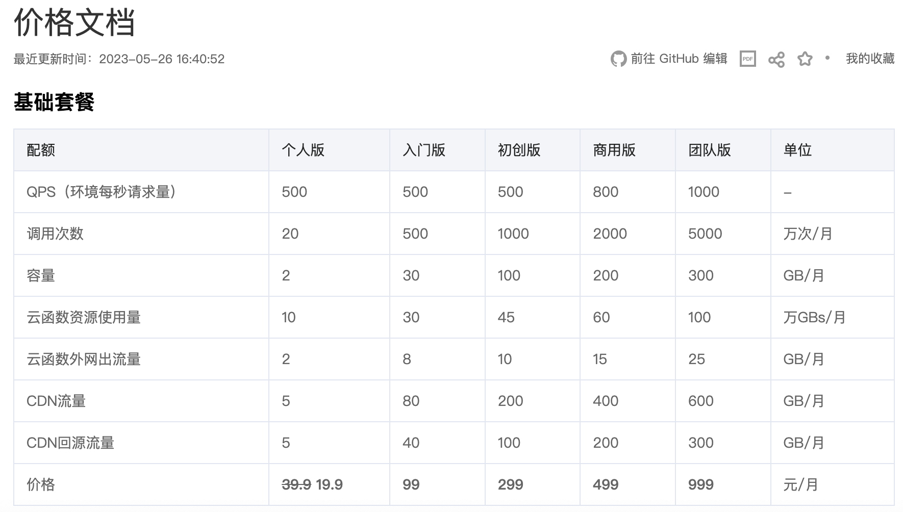
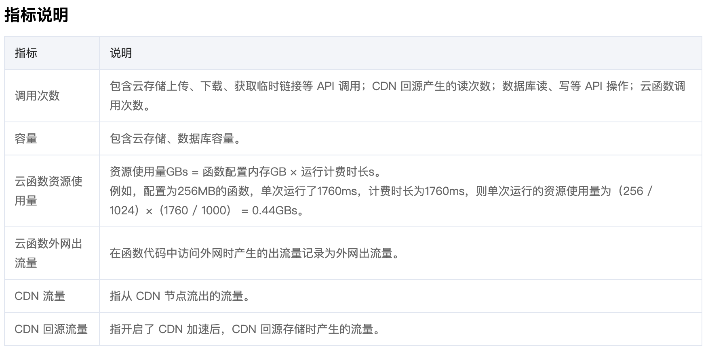
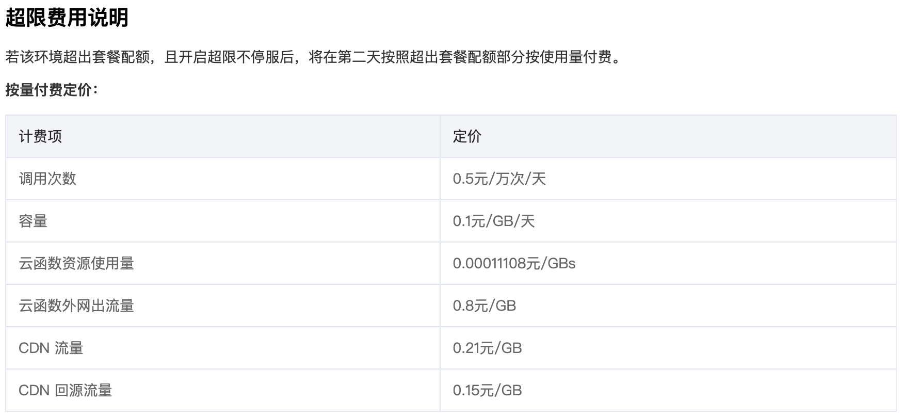
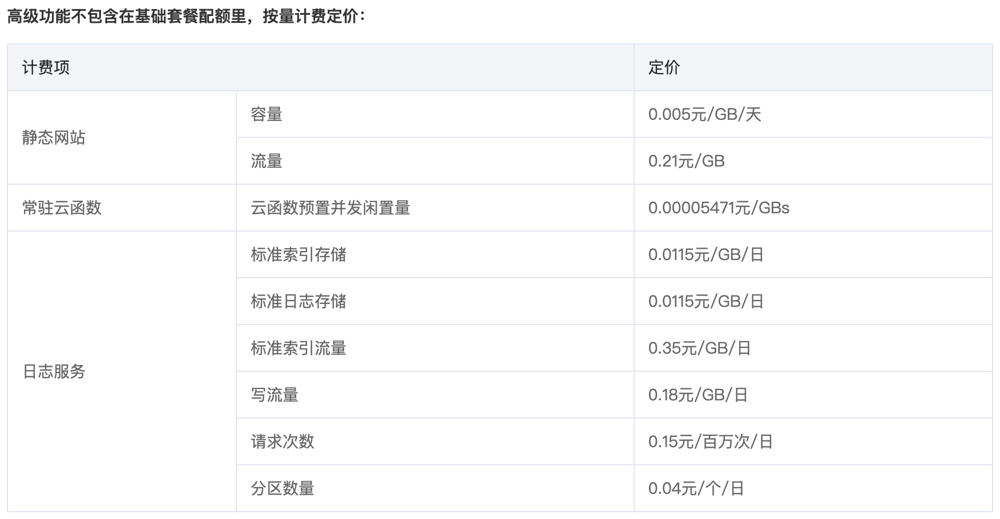
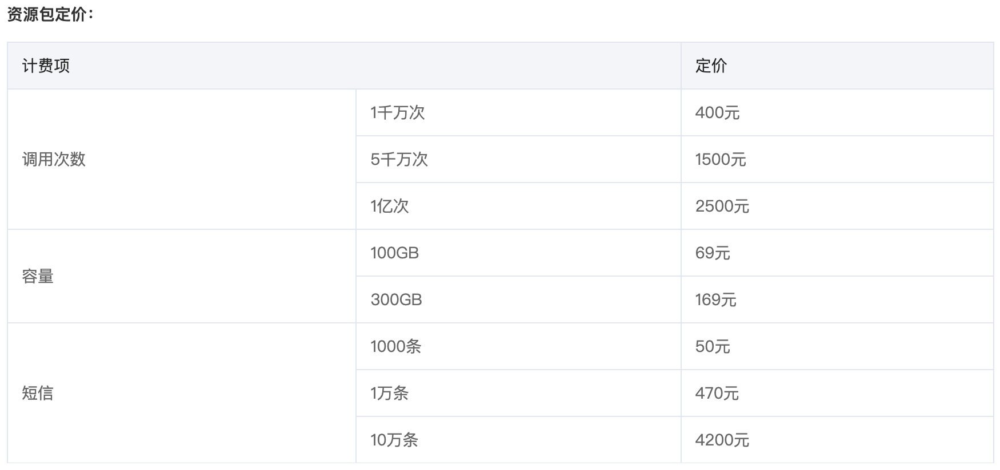
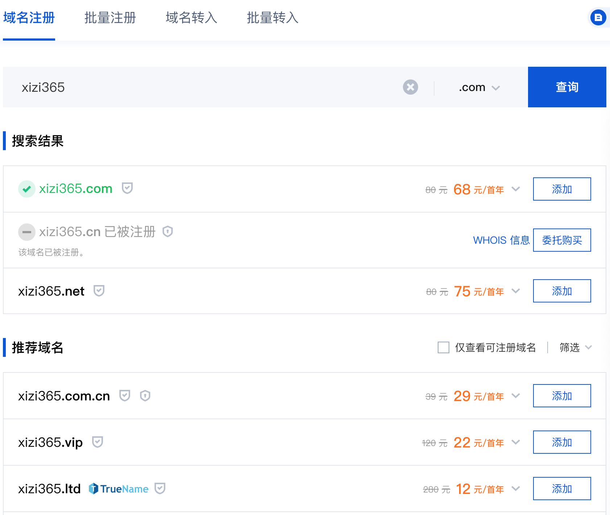

### [腾讯云](https://cloud.tencent.com/?fromSource=gwzcw.7382755.7382755.7382755&utm_medium=cpc&utm_id=gwzcw.7382755.7382755.7382755)

* [云开发 CloudBase](https://cloud.tencent.com/document/product/876)

#### 费用

#### 能力

[云开发支持在小程序、Web 应用、移动 App 等场景下使用](https://cloud.tencent.com/document/product/876/51912)

[将 Web 应用托管至云开发，支持静态网站、动态网站、SSR（Server Side Rendering）等多种应用形式](https://cloud.tencent.com/document/product/876/51914)

[CloudBase 提供一站式的后台即服务，支持小程序、Web、Unity 等多个平台，帮助各平台开发者高效开发应用](https://cloud.tencent.com/document/product/876/51928)

* [域名注册](https://dnspod.cloud.tencent.com/)

