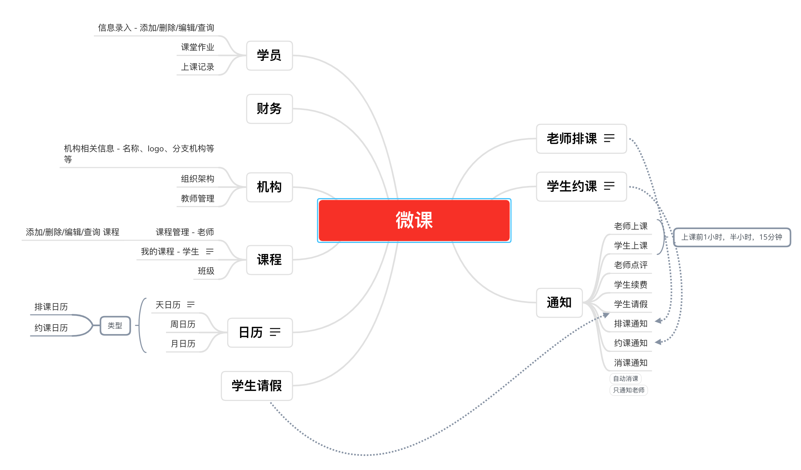
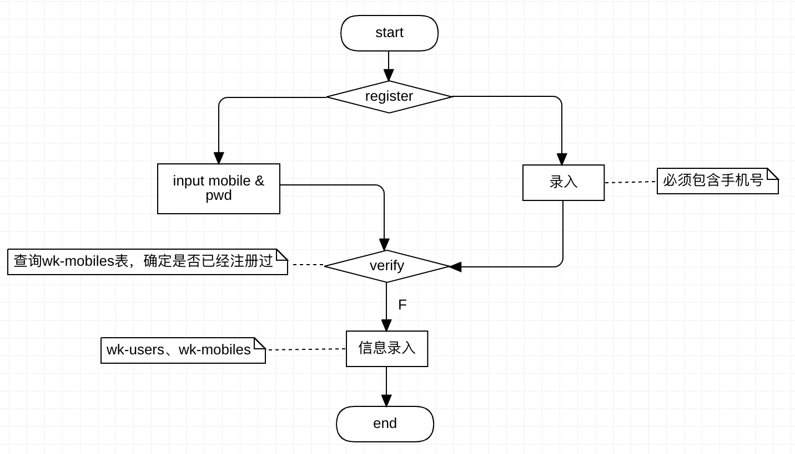
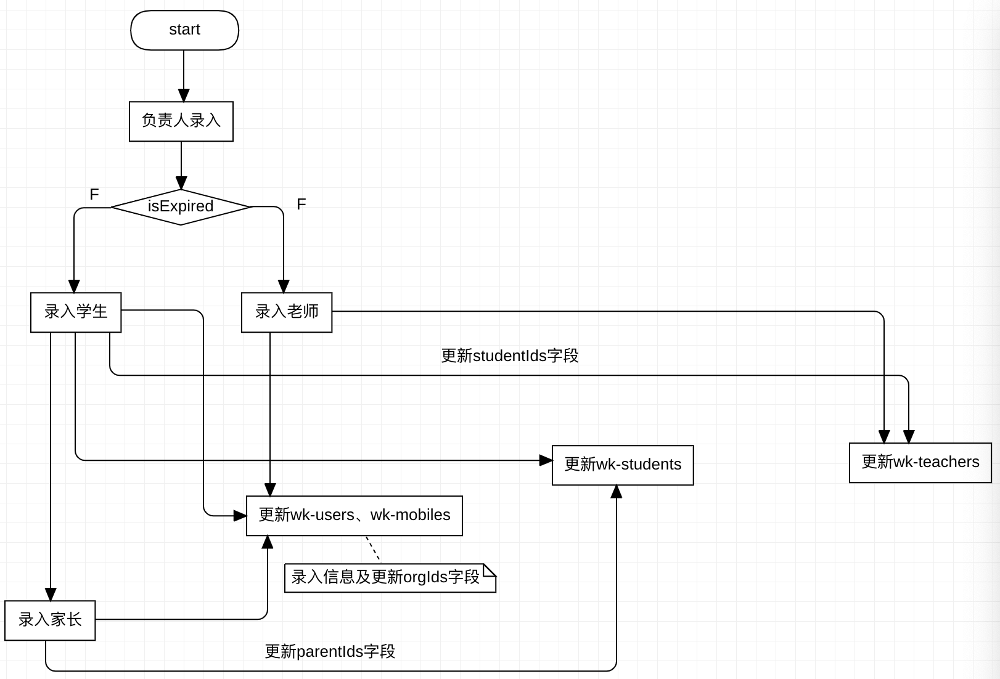
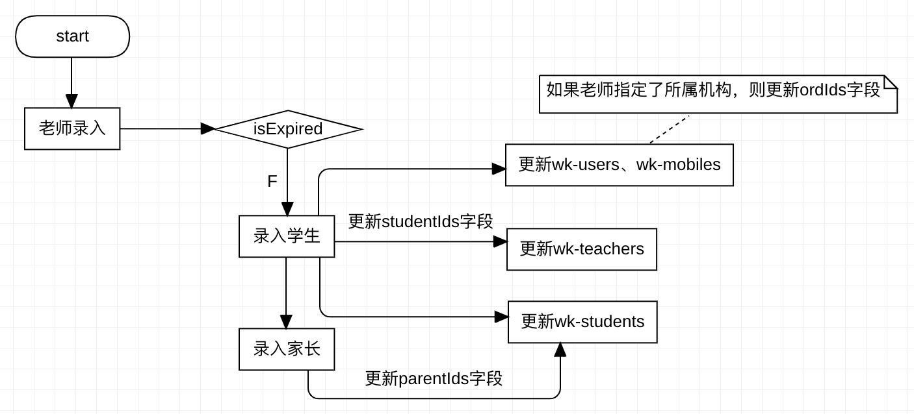
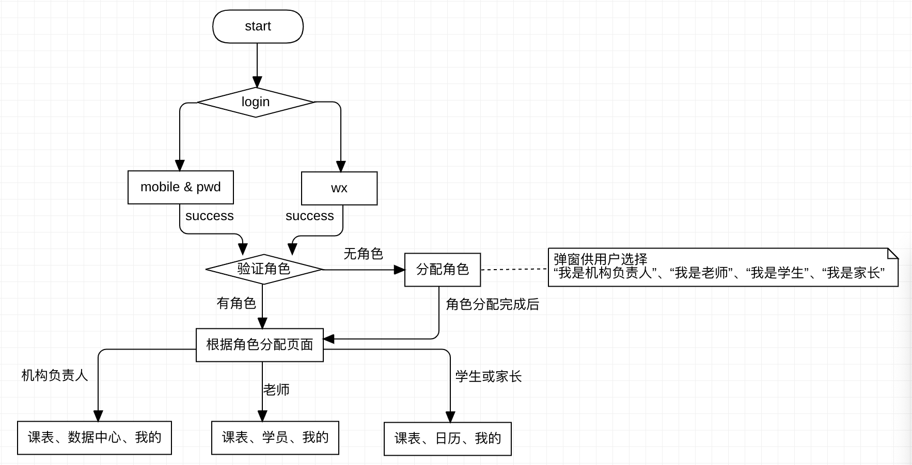

### 概览

### 详细设计

#### Users表

表名：wk-users

| 字段            | 类型      | 必填 | 描述                                                  |
| --------------- | --------- | ---- | ----------------------------------------------------- |
| _id             | Object ID | 是   | 存储文档 ID，系统自动生成                             |
| nickName        | String    | 否   | 用户昵称                                              |
| avatarUrl       | String    | 否   | 用户头像图片的 URL                                    |
| gender          | Integer   | 否   | 用户性别：0 未知 1 男性 2 女性                        |
| birthday        | Timestamp | 否   | 出生日期                                              |
| roles           | Array     | 否   | 1 机构负责人 2 老师 3 学生 4 家长                     |
| register_date   | Timestamp | 是   | 注册时间                                              |
| last_login_date | Timestamp | 否   | 最后登录时间                                          |
| mobile          | String    | 否   | 手机号码                                              |
| orgIds          | Array     | 否   | 用户所在机构的集合 （关联wk-orgs表的主键）限制最大100 |
| expire_date     | Timestamp | 是   | 过期时间                                              |
| inputCount      | Integer   | 是   | 机构负责人或老师录入的用户数，默认为0，最大500        |

#### Mobile表

表名：wk-mobiles

| 字段              | 类型      | 必填 | 描述                                 |
| ----------------- | --------- | ---- | ------------------------------------ |
| _id               | Object ID | 是   | 存储文档 ID（用户 ID），系统自动生成 |
| mobile            | String    | 是   | 手机号码，不允许重复                 |
| password          | String    | 否   | 密码，加密保存                       |
| smscode           | String    | 否   | 最新手机验证码                       |
| userId            | Object ID | 是   | 用户id，外键 （关联wk-users的主键）  |
| last_smscode_date | Timestamp | 否   | 最近一次收到验证码的时间戳           |

#### WX表

表名：wk-wx

| 字段       | 类型      | 必填 | 描述                                |
| ---------- | --------- | ---- | ----------------------------------- |
| _id        | Object ID | 是   | 存储文档 ID，系统自动生成           |
| wx_unionid | String    | 是   | 微信unionid                         |
| wx_openid  | String    | 否   | 微信小程序平台openid                |
| userId     | Object ID | 是   | 用户id，外键 （关联wk-users的主键） |

#### Mobile表与WX表的关联表

表名：wk-mobiles-wx

| 字段     | 类型      | 必填 | 描述                                  |
| -------- | --------- | ---- | ------------------------------------- |
| _id      | Object ID | 是   | 存储文档 ID，系统自动生成             |
| mobileId | Object ID | 是   | 外键，用户id （关联wk-mobiles的主键） |
| wxId     | Object ID | 是   | 外键，微信id（关联wk-wx的主键）       |

#### 机构表

表名：wk-orgs

| 字段       | 类型      | 必填 | 描述                      |
| ---------- | --------- | ---- | ------------------------- |
| _id        | Object ID | 是   | 存储文档 ID，系统自动生成 |
| name       | String    | 是   | 机构名称                  |
| tel        | String    | 否   | 座机号                    |
| addr       | String    | 否   | 地址                      |
| desc       | String    | 否   | 描述                      |
| logo       | String    | 否   | 机构logo的url             |
| createTime | Timestamp | 是   | 机构的创建时间            |

#### 老师表

表名：wk-teachers

| 字段       | 类型      | 必填 | 描述                                         |
| ---------- | --------- | ---- | -------------------------------------------- |
| _id        | Object ID | 是   | 存储文档 ID，系统自动生成                    |
| studentIds | Array     | 否   | 学生id集合 （关联wk-students）限制最大1000   |
| userId     | Object ID | 是   | 外键，用户id（关联wk-users的主键）           |
| courseIds  | Array     | 否   | 老师所教授课程的id集合（wk-courses的主键id） |

#### 班级表

表名：wk-class

| 字段       | 类型      | 必填 | 描述                                          |
| ---------- | --------- | ---- | --------------------------------------------- |
| _id        | Object ID | 是   | 存储文档 ID，系统自动生成                     |
| name       | String    | 是   | 班级名称                                      |
| teacherIds | Array     | 否   | 班级授课老师的id集合（wk-teachers表的主键id） |
| studentIds | Array     | 否   | 学生id集合 （关联wk-students）限制最大100     |
| orgId      | Object ID | 否   | 班级所属机构id                                |
| courseIds  | Array     | 否   | 班级课程的id集合（wk-courses的主键id）        |
|            |           |      |                                               |

#### 学生表

表名：wk-students

| 字段      | 类型      | 必填 | 描述                                        |
| --------- | --------- | ---- | ------------------------------------------- |
| _id       | Object ID | 是   | 存储文档 ID，系统自动生成                   |
| userId    | Object ID | 是   | 外键，用户id（关联wk-users的主键）          |
| parentId  | Array     | 否   | 家长id集合（关联wk-users）限制最大5         |
| courseIds | Array     | 否   | 学生参与课程的id集合 （wk-courses的主键id） |

#### 课程表

表名：wk-courses

| 字段      | 类型      | 必填 | 描述                      |
| --------- | --------- | ---- | ------------------------- |
| _id       | Object ID | 是   | 存储文档 ID，系统自动生成 |
| name      | String    | 是   | 课程名称                  |
| desc      | String    | 否   | 课程简介                  |
| icon      | String    | 否   | 字体图标                  |
| orgId     | Object ID | 否   | 课程所属机构id            |
| teacherId | Object ID | 否   | 课程所属老师id            |

***注：课程必须从属于机构或老师，如果老师从属于某机构，那么老师添加课程时，表记录的orgId记录该机构的id，teacherId为空；如果老师不从属于机构，那么表记录的orgId为空，teacherId记录该老师的id***

#### 课程记录表

表名：wk-course-records

| 字段      | 类型      | 必填 | 描述                                           |
| --------- | --------- | ---- | ---------------------------------------------- |
| _id       | Object ID | 是   | 存储文档 ID，系统自动生成                      |
| courseId  | Object ID | 是   | 外键，课程id （关联wk-courses表的主键id）      |
| teacherId | Object ID | 是   | 外键，授课老师id （关联wk-teachers表的主键id） |
| members   | Array     | 是   | 学生的id集合 （wk-students表的主键id）         |
| hour      | Integer   | 是   | 消耗课时数                                     |
| date      | Timestamp | 是   | 上课时间                                       |
|           |           |      |                                                |

#### 缴费记录表

表名：wk-payment-records

| 字段      | 类型      | 必填 | 描述                                     |
| --------- | --------- | ---- | ---------------------------------------- |
| _id       | Object ID | 是   | 存储文档 ID，系统自动生成                |
| studentId | Object ID | 是   | 外键，学生id （关联wk-students表主键id） |
| date      | Timestamp | 是   | 购买课程时间戳                           |
| courseId  | Object ID | 是   | 外键，课程id （关联wk-courses表主键id）  |
| hour      | Integer   | 是   | 购买的课时数                             |
| price     | float     | 是   | 缴费金额                                 |

#### 订单表

表面：wk-orders

| 字段   | 类型      | 必填 | 描述                               |
| ------ | --------- | ---- | ---------------------------------- |
| _id    | Object ID | 是   | 存储文档 ID，系统自动生成          |
| type   | Integer   | 是   | 1: 月付订单、2: 年付订单           |
| date   | Timestamp | 是   | 订单时间                           |
| price  | float     | 是   | 订单金额                           |
| userId | Object ID | 是   | 外键，用户id（关联wk-users的主键） |

#### 业务逻辑

##### 注册

1. 手机号密码注册
2. 信息录入

3. 录入

   ***如果对方信息已经被录入，则录入时仅仅更新关系字段***

   * 机构负责人录入

     

   

   * 老师录入

     

##### 登录

##### 角色

1. 初次登录成功后自定义角色
2. 分配角色
   * 机构管理员录入信息时指定老师、学生、家长角色
   * 老师录入信息时指定学生、家长角色
   * 学生邀请老师、家长
   * 家长邀请老师
