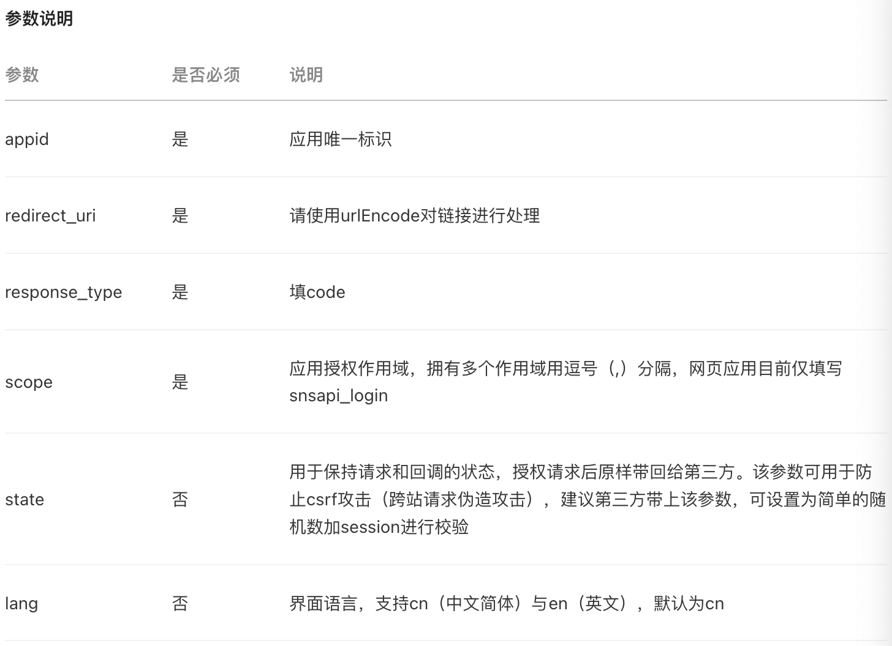
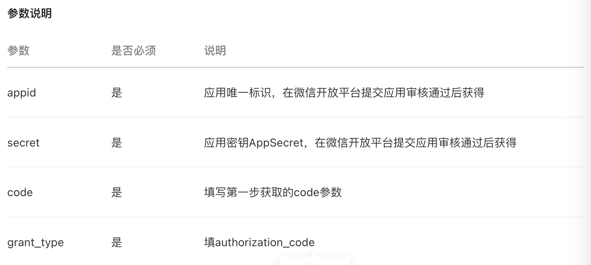
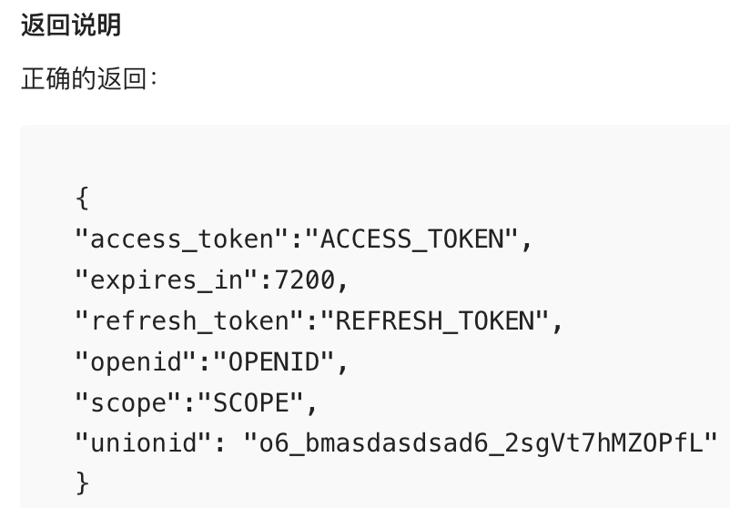
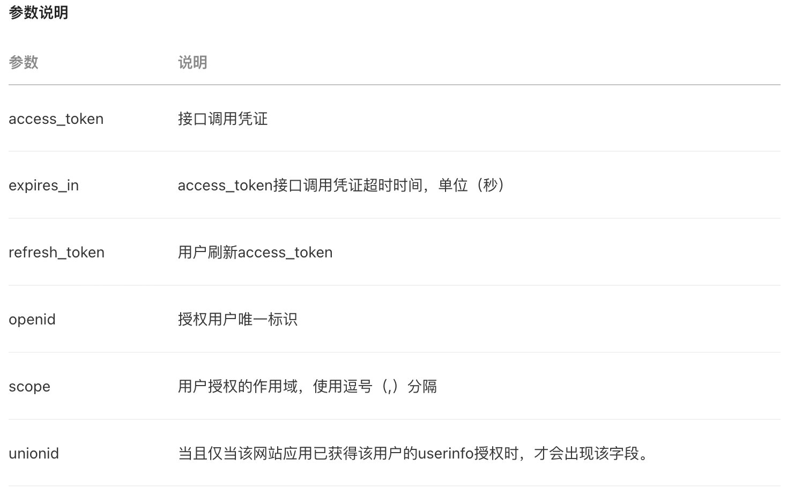
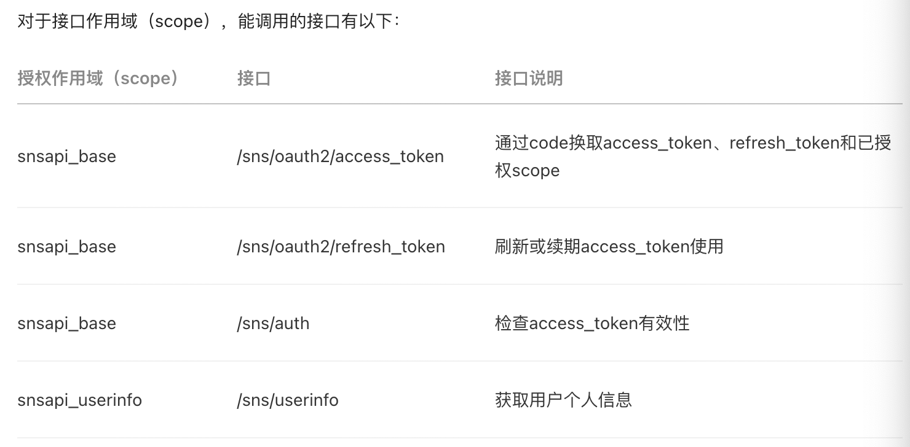
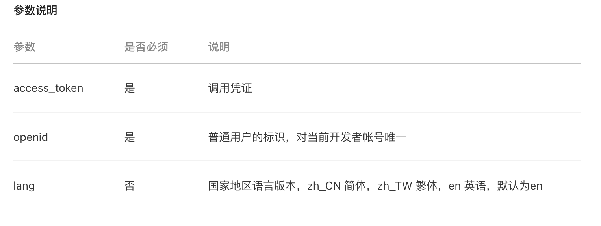
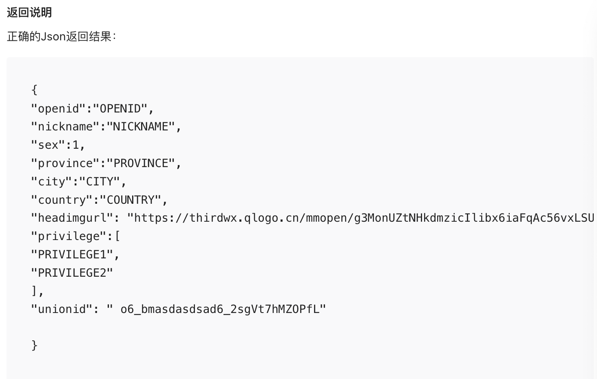
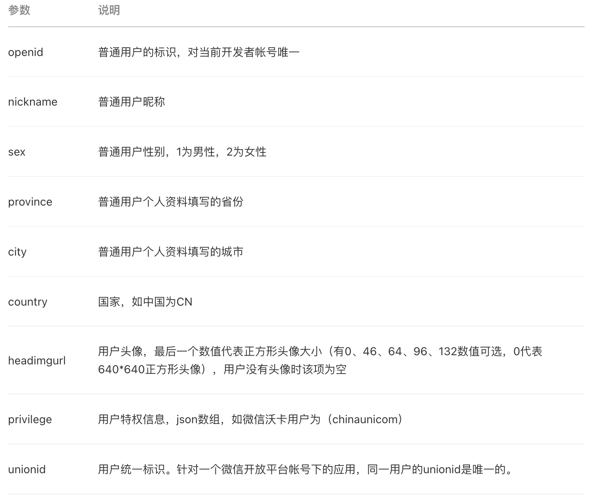
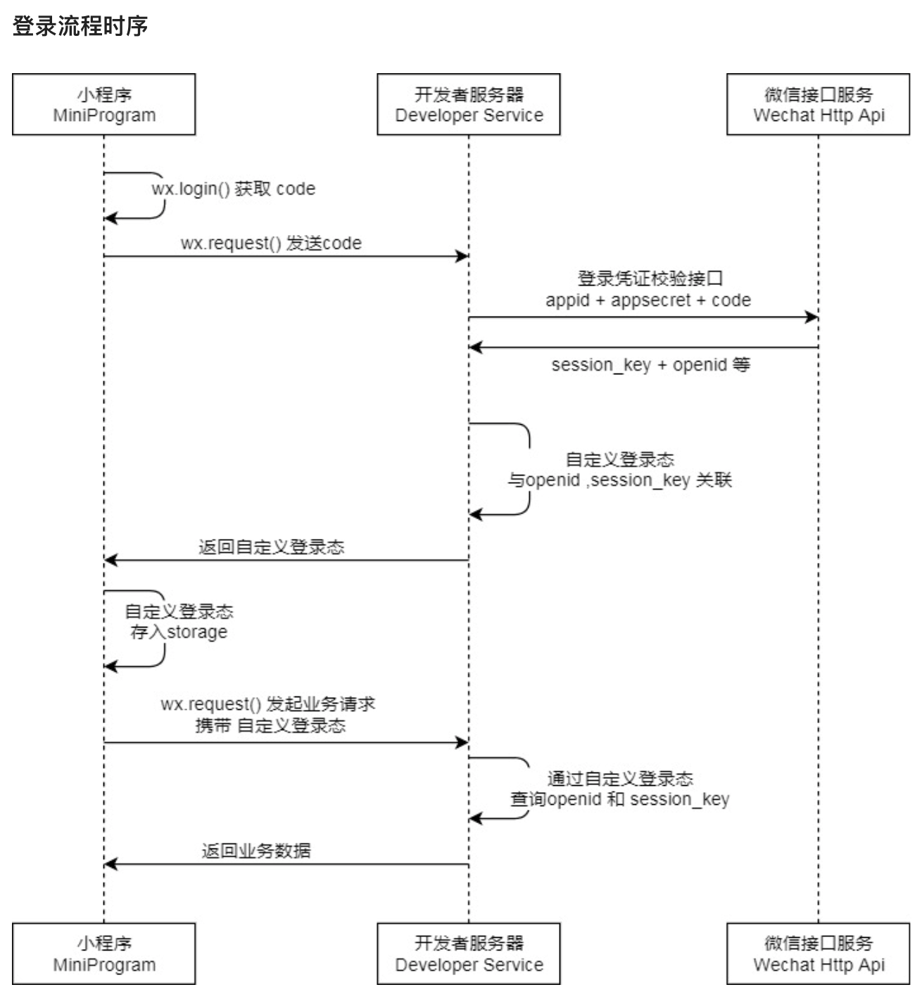

### 网站应用微信登录

[开发文档](https://developers.weixin.qq.com/doc/oplatform/Website_App/WeChat_Login/Wechat_Login.html)


```
1. 第三方发起微信授权登录请求，微信用户允许授权第三方应用后，微信会拉起应用或重定向到第三方网站，并且带上授权临时票据code参数；
2. 通过code参数加上AppID和AppSecret等，通过API换取access_token；
3. 通过access_token进行接口调用，获取用户基本数据资源或帮助用户实现基本操作。
```

1. 准备工作

   在微信开放平台注册开发者帐号，并拥有一个已审核通过的网站应用，并获得相应的AppID和AppSecret，申请微信登录且通过审核后，可开始接入流程

2. 请求CODE

   

3. 通过code获取access_token

   

   

   

4. 通过access_token调用接口

   ```
   1. access_token有效且未超时；
   2. 微信用户已授权给第三方应用帐号相应接口作用域（scope）。
   ```

   

通过微信授权登录可以获取微信用户的`openid`；若用户同意授权许可为`snsapi/userinfo`，即用户同意获取个人信息时，则可以获取到用户的个人信息，如`unionid`

5. 获取用户个人信息（UnionID机制）

   **接口说明**

   此接口用于获取用户个人信息。开发者可通过OpenID来获取用户基本信息。特别需要注意的是，如果开发者拥有多个移动应用、网站应用和公众帐号，可通过获取用户基本信息中的unionid来区分用户的唯一性，因为只要是同一个微信开放平台帐号下的移动应用、网站应用和公众帐号，用户的unionid是唯一的。换句话说，同一用户，对同一个微信开放平台下的不同应用，unionid是相同的。请注意，在用户修改微信头像后，旧的微信头像URL将会失效，因此开发者应该自己在获取用户信息后，将头像图片保存下来，避免微信头像URL失效后的异常情况。

   

   

   

   **开发者最好保存用户unionID信息，以便以后在不同应用中进行用户信息互通**


### 小程序登录

[文档](https://developers.weixin.qq.com/miniprogram/dev/framework/open-ability/login.html)



#### UnionID获取途径

绑定了开发者帐号的小程序，可以通过以下途径获取 UnionID

1. 开发者可以直接通过 [wx.login](https://developers.weixin.qq.com/miniprogram/dev/api/open-api/login/wx.login.html) + `code2Session` 获取到该用户 UnionID，无须用户授权
2. 小程序端调用云函数时，可在云函数中通过 [Cloud.getWXContext](https://developers.weixin.qq.com/miniprogram/dev/wxcloud/reference-sdk-api/utils/Cloud.getWXContext.html) 获取 UnionID
3. 用户在小程序（暂不支持小游戏）中支付完成后，开发者可以直接通过`getPaidUnionId`接口获取该用户的 UnionID，无需用户授权。注意：本接口仅在用户支付完成后的5分钟内有效，请开发者妥善处理。